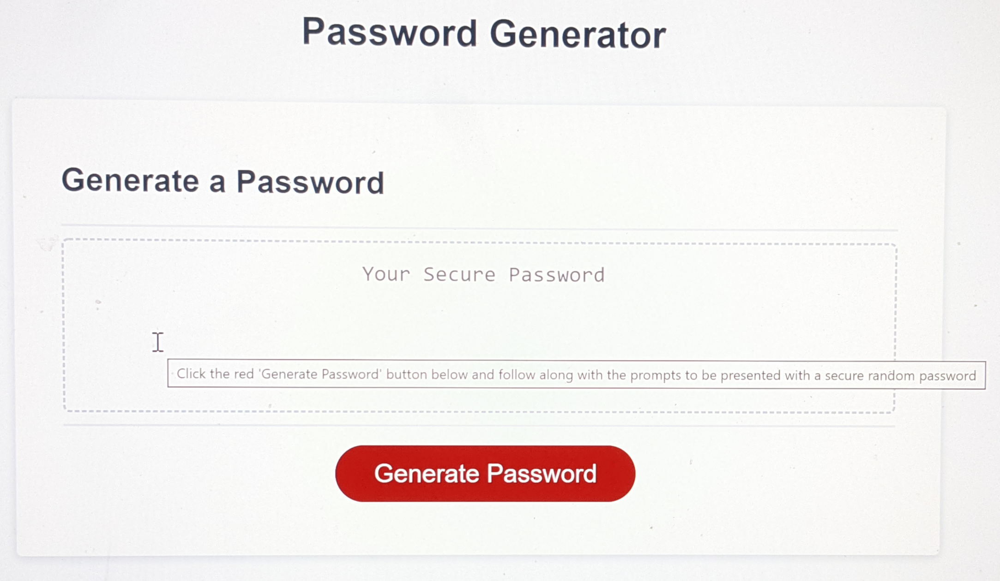
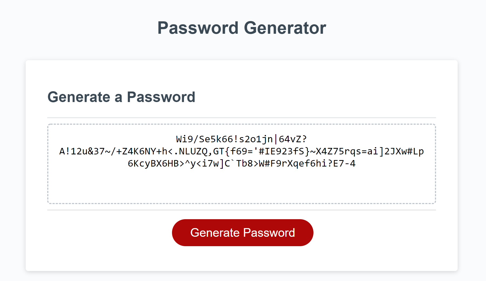
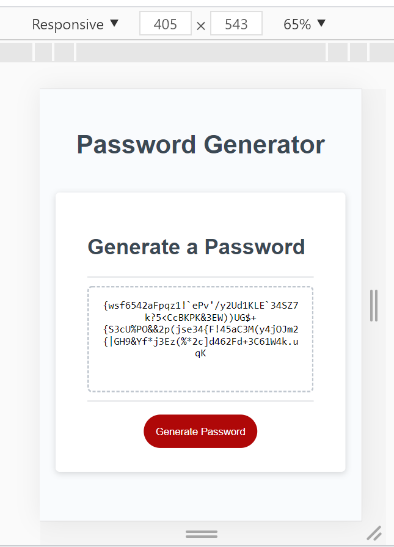

# 03 JavaScript: Password Generator

```
This week’s homework requires starter code modification to create an application that enables employees to generate random passwords based on criteria that they’ve selected. This app will run in the browser and will feature dynamically updated HTML and CSS powered by JavaScript code that you write. It will have a clean and polished, responsive user interface that adapts to multiple screen sizes.

The password can include special characters. 
```

## User Story

```
AS AN employee with access to sensitive data I WANT to randomly generate a password that meets certain criteria SO THAT I can create a strong password that provides greater security
```

## Acceptance Criteria

```
GIVEN I need a new, secure password
✓ WHEN I click the button to generate a password THEN I am presented with a series of prompts for password criteria
✓ WHEN prompted for password criteria THEN I select which criteria to include in the password
✓ WHEN prompted for the length of the password THEN I choose a length of at least 8 characters and no more than 128 characters
✓ WHEN prompted for character types to include in the password THEN I choose lowercase, uppercase, numeric, and/or special characters
✓ WHEN I answer each prompt THEN my input should be validated and at least one character type should be selected
✓ WHEN all prompts are answered THEN a password is generated that matches the selected criteria
✓ WHEN the password is generated THEN the password is either displayed in an alert or written to the page
```

--------------------------------
# DNB's SOLUTION: 
UNC Boot Camp Submission: 🗂️ [Github Repository](https://github.com/DionneNoellaBarretto/03--PasswordGenerator_JavaScript) | 📄[Github Page](https://dionnenoellabarretto.github.io/03--PasswordGenerator_JavaScript/)

Another Work in Progress Solution (Practice Attempt): 🗂️ [Github Repository](https://github.com/DionneNoellaBarretto/Week3Practice) | 📄[Github Page](https://dionnenoellabarretto.github.io/Week3Practice/)

--------------------------------

## Mock-Up

The following image shows the web application's appearance and functionality:


Following are Desktop, Tablet and Mobile Views: 





## Grading Requirements

This homework is graded based on the following criteria: 

### Technical Acceptance Criteria: 40%
Satisfies all of the preceding acceptance criteria plus the following:
```
✅The homework should not produce any errors in the console when you inspect it using Chrome DevTools.
```


### Deployment: 32%
```
✅Application deployed at live URL.

✅Application loads with no errors.

✅Application GitHub URL submitted.

✅GitHub repository that contains application code.
```
### Application Quality: 15%
```
✅Application user experience is intuitive and easy to navigate.

✅Application user interface style is clean and polished.

✅Application resembles the mock-up functionality provided in the homework instructions.
```
### Repository Quality: 13%
```
✅Repository has a unique name.

✅Repository follows best practices for file structure and naming conventions.

✅Repository follows best practices for class/id naming conventions, indentation, quality comments, etc.

✅Repository contains multiple descriptive commit messages.

✅Repository contains quality readme file with description, screenshot, and link to deployed application.
```